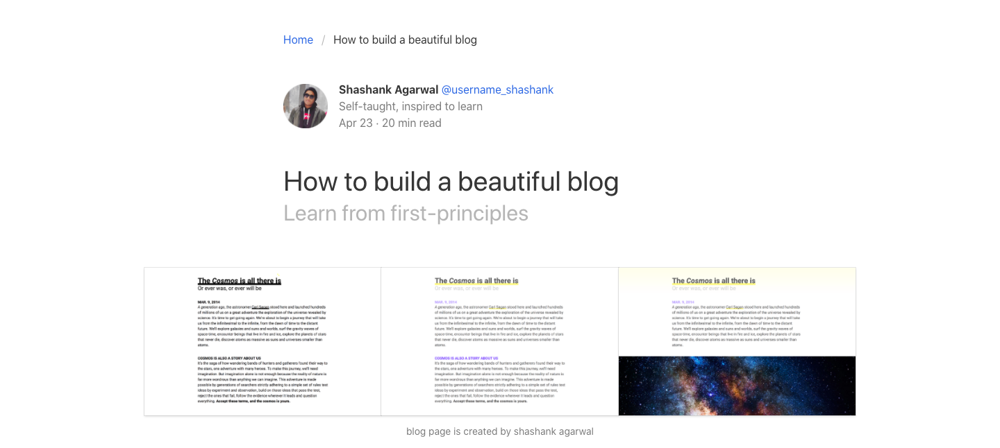
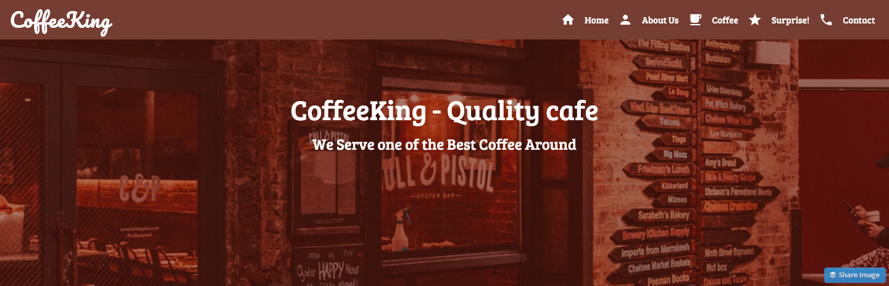

# Static-Websites 🌐

I started my journey of learning Web Development through creating Static Websites using HTML, CSS (and it frameworks such as Bulma, Materialize & Tailwind) and Javascript. I thought why not document them in single repository :)

## Omnifood - Food Delivery Company

Omnifood is an imaginary Food Delivery Company based in Ireland.

- The page purpose was to showcase their services and mobile application.
  To make good impact I developed the landing section of the page with parallax effect in the background image and hovering effect in the navigation bar and in button.

- To provide good quality icons as image in services section i use fontawesome.

- the purpose of make the webpage design as simple & clear i use grid css to provide better structure.

You can check the live preview of website by [Click Here](https://omni-foods.netlify.app/)

#### Languages Used: HTML, CSS and JS

## Blog Page - Bulma CSS Framework

- After Learning Native Languages of Web such as HTML, CSS and JS, i tried to create an Blog Page using CSS Framework named as Bulma

- the purpose of make the webpage design as simple & clear to provide more managed content so i use Bulma Framework for CSS.

You can check the live preview of website by [Click Here](https://blogpage-bulma.netlify.app/)

## CoffeeKing Brand Page - Materialized CSS Framework

- Creating Coffeeking Landing Page using Materialized CSS
- At that time, i understand how documentations are really helpful while developing webapps or webpages.
- the purpose of make the webpage design as simple & clear to provide more interactivity so i use Materialize CSS

You can check the live preview of website by [Click Here](https://coffeeking.netlify.app/)
